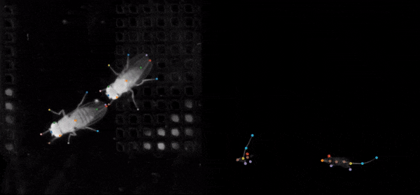

.. inclusion-marker-do-not-remove

|Appveyor Build Status| |GitHub release|

.. |Appveyor Build Status| image:: 
   https://ci.appveyor.com/api/projects/status/tf5qlylwqse8ack5/branch/master?svg=true 
   :target: https://ci.appveyor.com/project/talmo/sleap
   :alt: Appveyor build status

.. |GitHub release| image:: https://img.shields.io/github/release/murthylab/sleap.js.svg
   :target: https://GitHub.com/murthylab/sleap/releases/

Social LEAP Estimates Animal Pose (SLEAP)
=========================================

|

**S**\ ocial **L**\ EAP **E**\ stimates **A**\ nimal **P**\ ose (**SLEAP**) is a framework for multi-animal
body part position estimation via deep learning. It is the successor to LEAP_. **SLEAP** is written entirely in
Python, supports multi-animal pose estimation, animal instance tracking, and a labeling/training GUI that
supports active learning.

.. _LEAP: https://github.com/talmo/leap

.. _Installation:

Installation
------------

**SLEAP** is compatible with Python versions 3.6 and above, with support for Windows and Linux. Mac OS X works but without GPU support.

Windows
-------

Since **SLEAP** has a number of complex binary dependencies (TensorFlow, Keras, OpenCV), it is recommended to use the
Anaconda_ Python distribution to simplify installation.

Once Anaconda_ has been installed, go to start menu and type in *Anaconda*, which should bring up a menu entry
**Anaconda Prompt** which opens a command line with the base anaconda environment activated. One of the key
advantages to using `Anaconda Environments`_ is the ability to create separate Python installations (environments) for
different projects, mitigating issues of managing complex dependencies. To create a new conda environment for
**SLEAP** related development and use:

::

    (base) C:\>  conda create -n sleap_env -c defaults -c sleap sleap python=3.6 -y

Once the environment is finished installing, it can be activated using the following command:

::

    (base) C:\> conda activate sleap_env
    (sleap_env) C:\>

Any Python installation commands (:code:`conda install` or :code:`pip install`) issued after activating an
environment will only effect the environment. Thus it is important to make sure the environment is active when issuing
any commands that deal with Python on the command line.

**SLEAP** is now installed in the :code:`sleap_env` conda environment. With the environment active,
you can run the labeling GUI by entering the following command:

::

(sleap_env) C:\> sleap-label

.. _Anaconda: https://www.anaconda.com/distribution/
.. _Anaconda Environments: https://docs.conda.io/projects/conda/en/latest/user-guide/tasks/manage-environments.html

Linux
-----

No Linux conda packages are currently provided by the **SLEAP** channel. However, installing via :code:`pip` should not
be difficult on most Linux systems. The first step is to get a working version of TensorFlow installed in your Python
environment. Follow official directions for installing TensorFlow_ with GPU support. Once TensorFlow is installed, simple
issue the following command to install **SLEAP**

.. _TensorFlow: https://www.tensorflow.org/install/gpu

::

    pip install git+https://github.com/murthylab/sleap.git

**SLEAP** is now installed you can run the labeling GUI by entering the following command:

::

> sleap-label

Mac OS
------

The installation for Mac OS X is the same as for Linux, although there's no TensorFlow GPU support for Mac OS.
You can install TensorFlow and **SLEAP** together by running

::

    pip install tensorflow git+https://github.com/murthylab/sleap.git

Research
--------
If you use **SLEAP** in your research please acknowledge ... 

