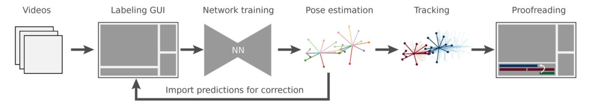

# SLEAP Workflow

SLEAP enables you to train deep learning models that automatically track body parts of any animal from video for precise and quantitative analysis of behavioral data. This page walks through the typical end-to-end workflow.

!!! tip "New to SLEAP?"
    Follow along with the hands-on [Tutorial](tutorial/overview.md) to learn each step in detail.

---

## 📁 Phase 1: Setup

### 1. Create a project and import videos

Import video clips from your experiment footage. These will be used to build your training dataset.

[:octicons-arrow-right-24: Importing new data](tutorial/importing-data.md)

### 2. Define the skeleton

List the body parts you want to track and how they connect to each other.

[:octicons-arrow-right-24: Defining Animal Skeleton](tutorial/importing-data.md/#configure-skeleton)

---

## 🏷️ Phase 2: Label

### 3. Select frames for labeling

Choose an initial set of frames to label. SLEAP provides sampling methods based on image features to help you pick diverse frames.

[:octicons-arrow-right-24: Selecting Frames](tutorial/initial-labeling.md/#generate-suggestions)

### 4. Label animal poses

Manually place skeleton body parts on animals in each frame. This is the most time-intensive step, but SLEAP's GUI makes it fast.

[:octicons-arrow-right-24: Labeling First Frame](tutorial/initial-labeling.md/#labeling-the-first-frame)

---

## 🧠 Phase 3: Train

### 5. Train the model

Train a neural network on your labeled frames. SLEAP supports multiple model architectures and training configurations.

[:octicons-arrow-right-24: Initial Training](tutorial/training-a-model.md)

### 6. Run inference

Apply the trained model to predict poses on unlabeled frames. Prediction quality depends on label quality, quantity, and training settings.

### 7. Refine and repeat

Inspect predictions, correct errors, and retrain. This human-in-the-loop cycle rapidly improves model accuracy.

[:octicons-arrow-right-24: Assisted Labeling](tutorial/correcting-predictions.md/#labeling-from-predictions)

!!! info "Active Learning"
    You typically only need to label **100-500 frames** to get accurate predictions on thousands of frames. Each correction you make improves the model.

---

## 🚀 Phase 4: Deploy

### 8. Process additional videos

Once your model performs well, apply it to all your experiment videos.

[:octicons-arrow-right-24: Import predictions for labeling](guides/importing-predictions-for-labeling.md)

### 9. Track identities

Link detections across frames to create continuous tracks for each animal. SLEAP provides several tracking algorithms.

[:octicons-arrow-right-24: Track new data](tutorial/tracking-new-data.md)

### 10. Proofread tracks

Review tracking results in the GUI and fix any identity swaps or errors.

[:octicons-arrow-right-24: Track Proofreading](tutorial/proofreading.md)

### 11. Export for analysis

Export pose data and tracks for downstream analysis in Python, MATLAB, or other tools.

[:octicons-arrow-right-24: Export Analysis](tutorial/exporting-the-results.md)

[:octicons-arrow-right-24: Example Notebooks](notebooks/Analysis_examples.ipynb)

---

## Next Steps

[:octicons-arrow-right-24: Start the Tutorial](tutorial/overview.md) – Step-by-step walkthrough of the complete workflow

[:octicons-arrow-right-24: Skeleton Design](learnings/skeleton-design.md) – Tips for designing effective skeletons

[:octicons-arrow-right-24: Model Configuration](https://nn.sleap.ai/latest/reference/models/) – Choose the right model type for your data
