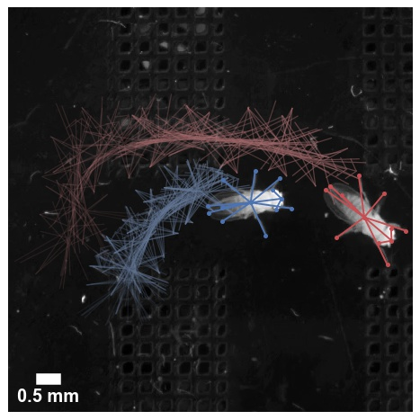

# Datasets

Here we provide a number of sample and benchmark datasets that can be used for
experimenting with or extending SLEAP.

These datasets are all saved as `.pkg.slp` files, which are self-contained SLEAP labels
together with embedded image data. See [](notebooks/Data_structures) for examples on how
to work with SLEAP files.

For the full set of labeled datasets and trained models reported in the SLEAP paper
([Pereira et al., Nature Methods, 2022](https://www.nature.com/articles/s41592-022-01426-1)),
please see the [OSF repository](https://osf.io/36har/).


## `fly32`


```{list-table}
---
header-rows: 0
stub-columns: 1
width: 80%
widths: 10 40
---
* - Name
  - `fly32`
* - Description
  - Animal-centered movies of single fruit fly (*Drosophila melanogaster*) freely moving in an enclosed circular arena with backlight. Videos were recorded with a camera that followed animal, so all images are roughly centered.
* - Videos
  - 59
* - Image size
  - 192 x 192 x 1
* - FPS
  - 100
* - Resolution
  - 35 px / mm
* - Skeleton
  - 32 nodes
* - Num Animals
  - 1
* - Identity
  - ✘
* - Labels
  - 1500
* - Download
  - [Train](https://storage.googleapis.com/sleap-data/datasets/BermanFlies/random_split1/train.pkg.slp) / [Validation](https://storage.googleapis.com/sleap-data/datasets/BermanFlies/random_split1/val.pkg.slp) / [Test](https://storage.googleapis.com/sleap-data/datasets/BermanFlies/random_split1/test.pkg.slp)
* - Credit
  - [Berman et al. (2014)](https://royalsocietypublishing.org/doi/10.1098/rsif.2014.0672), [Pereira et al. (2019)](https://www.nature.com/articles/s41592-018-0234-5), [Pereira et al. (2022)](https://www.nature.com/articles/s41592-022-01426-1), Talmo Pereira, Gordon Berman, Joshua Shaevitz
```

## `flies13`


```{list-table}
---
header-rows: 0
stub-columns: 1
width: 80%
widths: 10 40
---
* - Name
  - `flies13`
* - Description
  - Freely interacting pairs of virgin male and female fruit flies (*Drosophila melanogaster*, NM91 strain) 3 to 5 days post-eclosion. Animals frequently engage in courtship behavior.
* - Videos
  - 30
* - Image size
  - 1024 x 1024 x 1
* - FPS
  - 150
* - Resolution
  - 30.3 px / mm
* - Skeleton
  - 13 nodes
* - Num Animals
  - 2
* - Identity
  - ✔
* - Labels
  - 2000 frames, 2000 instances
* - Download
  - [Train](https://storage.googleapis.com/sleap-data/datasets/wt_gold.13pt/tracking_split2/train.pkg.slp) / [Validation](https://storage.googleapis.com/sleap-data/datasets/wt_gold.13pt/tracking_split2/val.pkg.slp) / [Test](https://storage.googleapis.com/sleap-data/datasets/wt_gold.13pt/tracking_split2/test.pkg.slp)
* - Credit
  - [Pereira et al. (2022)](https://www.nature.com/articles/s41592-022-01426-1), Junyu Li, Shruthi Ravindranath, Talmo Pereira, Mala Murthy
```

## `mice_of`


```{list-table}
---
header-rows: 0
stub-columns: 1
width: 80%
widths: 10 40
---
* - Name
  - `mice_of`
* - Description
  - Freely moving C57BL/6J mice (*Mus musculus*) in 45.7 x 45.7 cm open field arena with a clear acrylic floor, imaged from below to ensure paw visibility.
* - Videos
  - 20
* - Image size
  - 1280 x 1024 x 1
* - FPS
  - 80
* - Resolution
  - 1.97 px / mm
* - Skeleton
  - 11 nodes
* - Num Animals
  - 1-5
* - Identity
  - ✘
* - Labels
  - 1000 frames, 2950 instances
* - Download
  - [Train](https://storage.googleapis.com/sleap-data/datasets/wang_4mice_john/labels.full/random_split1/train.pkg.slp) / [Validation](https://storage.googleapis.com/sleap-data/datasets/wang_4mice_john/labels.full/random_split1/val.pkg.slp) / [Test](https://storage.googleapis.com/sleap-data/datasets/wang_4mice_john/labels.full/random_split1/test.pkg.slp)
* - Credit
  - [Pereira et al. (2022)](https://www.nature.com/articles/s41592-022-01426-1), John D'Uva, Mikhail Kislin, Samuel S.-H. Wang
```

## `mice_hc`


```{list-table}
---
header-rows: 0
stub-columns: 1
width: 80%
widths: 10 40
---
* - Name
  - `mice_hc`
* - Description
  - Pairs of male and female white Swiss Webster mice (*Mus musuculus*) imaged in a home cage environment with lightly-colored bedding, imaged from above. Animals are fairly low contrast with respect to the background.
* - Videos
  - 40
* - Image size
  - 1280 x 1024 x 1
* - FPS
  - 40
* - Resolution
  - 1.9 px / mm
* - Skeleton
  - 5 nodes
* - Num Animals
  - 2
* - Identity
  - ✘
* - Labels
  - 1474 frames, 2948 instances
* - Download
  - [Train](https://storage.googleapis.com/sleap-data/datasets/eleni_mice/random_split1/train.pkg.slp) / [Validation](https://storage.googleapis.com/sleap-data/datasets/eleni_mice/random_split1/val.pkg.slp) / [Test](https://storage.googleapis.com/sleap-data/datasets/eleni_mice/random_split1/test.pkg.slp)
* - Credit
  - [Pereira et al. (2022)](https://www.nature.com/articles/s41592-022-01426-1), Eleni Papadoyannis, Mala Murthy, Annegret Falkner
```

## `bees`


```{list-table}
---
header-rows: 0
stub-columns: 1
width: 80%
widths: 10 40
---
* - Name
  - `bees`
* - Description
  - Pairs of female worker bumblebees (*Bombus impatiens*) freely interacting in a petri dish with hexagonal beeswax flooring for up to 30 minutes
* - Videos
  - 18
* - Image size
  - 1536 x 2048 x 1
* - FPS
  - 100
* - Resolution
  - 14 px / mm
* - Skeleton
  - 21 nodes
* - Num Animals
  - 2
* - Identity
  - ✘
* - Labels
  - 804 frames, 1604 instances
* - Download
  - [Train](https://storage.googleapis.com/sleap-data/datasets/yan_bees/random_split1/train.pkg.slp) / [Validation](https://storage.googleapis.com/sleap-data/datasets/yan_bees/random_split1/val.pkg.slp) / [Test](https://storage.googleapis.com/sleap-data/datasets/yan_bees/random_split1/test.pkg.slp)
* - Credit
  - [Pereira et al. (2022)](https://www.nature.com/articles/s41592-022-01426-1), Grace McKenzie-Smith, Z. Yan Wang, Joshua Shaevitz, Sarah Kocher
```

## `gerbils`


```{list-table}
---
header-rows: 0
stub-columns: 1
width: 80%
widths: 10 40
---
* - Name
  - `gerbils`
* - Description
  - Selected videos from a continuous monitoring setup of a home cage with 2 pup and 2 adult gerbils (*Meriones unguiculatus*), from P15 to 8 months old. Some animals are partially shaved to distinguish their appearance.
* - Videos
  - 23
* - Image size
  - 1024 x 1280 x 3
* - FPS
  - 25
* - Resolution
  - 2 px / mm
* - Skeleton
  - 14 nodes
* - Num Animals
  - 4
* - Identity
  - ✔
* - Labels
  - 425 frames, 1588 instances
* - Download
  - [Train](https://storage.googleapis.com/sleap-data/datasets/nyu-gerbils/cohort1_compressedTalmo_23vids_march_7_to_march_17/random_split1.day001/train.pkg.slp) / [Validation](https://storage.googleapis.com/sleap-data/datasets/nyu-gerbils/cohort1_compressedTalmo_23vids_march_7_to_march_17/random_split1.day001/val.pkg.slp) / [Test](https://storage.googleapis.com/sleap-data/datasets/nyu-gerbils/cohort1_compressedTalmo_23vids_march_7_to_march_17/random_split1.day001/test.pkg.slp)
* - Credit
  - [Pereira et al. (2022)](https://www.nature.com/articles/s41592-022-01426-1), Catalin Mitelut, Marielisa Diez Castro, Dan H. Sanes
```