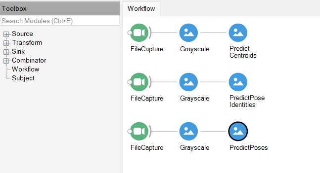

(bonsai)=

# Using Bonsai with SLEAP'

Bonsai is a visual language for reactive programming and currently supports SLEAP models.

**Exporting a SLEAP trained model:**

:::{note}
Currently Bonsai supports only single instance, top-down and top-down-id SLEAP models.
:::

In order to import the trained model into Bonsai, we need to export the model using the {code}`sleap-export` cli command to convert the trained model to a Protocol buffer(.pb) format. For example, for the top-down-id model, the command is as follows:

```
sleap-export -m centroid_model_folder_path -m top_down_id_model_folder_path exported_model
```

(for further details please refer {ref} `sleap-export` docs for more details.)

This will generate the necessary `.pb` file and other information files to be used in Bonsai in the `exported_model` folder.

**Installing Bonsai and necessary packages:**

- Install bonsai by following the instructions provided in their [installation page](https://bonsai-rx.org/docs/articles/installation.html). 

- Add the necessary packages including the `Bonsai.SLEAP` and `Bonsai.SLEAP.Design` packages for SLEAP to run with Bonsai and to access the SLEAP-Bonsai modules. For more information on other dependency installations, please refer to the official [bonsai sleap documentation](https://github.com/bonsai-rx/sleap?tab=readme-ov-file#bonsai---sleap).

**Using Bonsai SLEAP modules:**

Once you have Bonsai installed with the required packages, you should be able to open the bonsai application. 

- The workflow must have an source module `FileCapture` which can be found in the toolbox search in the workflow editor. Provide the path to the video that was used to train the SLEAP model in the `FileName` field of the module.

- For the top-down model,
    - To predict the centroids, add the `PredictCentroid` module and provide the path to the training config JSON file for the centroid model in the `ModelFileName` field and the path to the `exported_model` folder containing the `.pb` file in the `TrainingConfig` field of the module.
    - To predict the instances, add the `PredictPoses` module and provide the path to the training config JSON file for the centered instance model in the `ModelFileName` field and the path to the `exported_model` folder containing the `.pb` file in the `TrainingConfig` field of the module.

- For the top-down-id model, to predict the instances with identities, add `PredictPoseIdentities` module and provide the path to the training config JSON file for the top-down-id model in the `ModelFileName` field and the path to the `exported_model` folder containing the `.pb` file in the `TrainingConfig` field of the module.

- For Single instance models, add the `PredictSinglePose` module and provide the path to the training config JSOn file for the single instance model in the `ModelFileName` field and the path to the `exported_model` folder containing the `.pb` file in the `TrainingConfig` field of the module.

The workflow in Bonsai will look something like the following:



- Once you have the basic workflow for Bonsai.SLEAP created and running successfully, you can add more modules to analyze and visualize the results in Bonsai.

For more documentation on various modules and workflows, please refer to the [official Bonsai docs](https://bonsai-rx.org/docs/articles/editor.html).