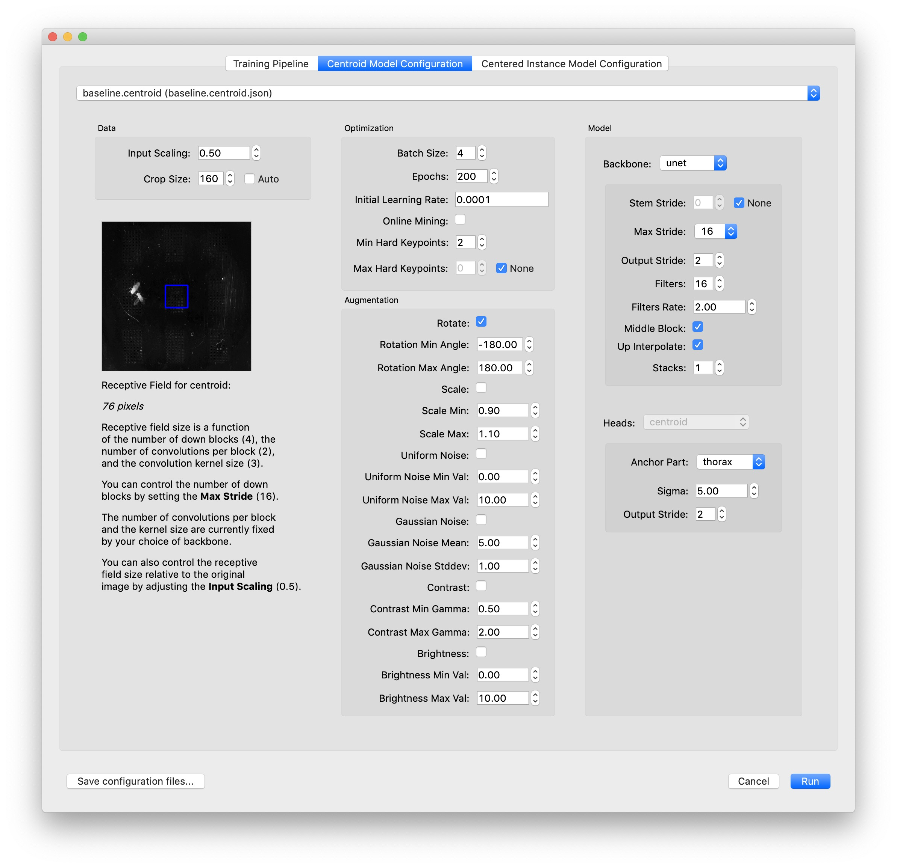

.. _choosing_models:

Choosing a set of models
========================

Inference will run in different modes depending on the output types of the models you supply. SLEAP currently support two distinct modes for multi-animal inference.

1. The "**bottom-up**" approach uses a single model which outputs **confidence maps** and **part affinity fields** for all instances in a given frame. The confidence maps are used to predict node locations and the part affinity fields are used to group nodes into distinct animal instances.

2. The "**top-down**" approach starts by using a **centroid** model to predict the location of each animal in a given frame, and then a **instance centered confidence map** model is used to predict the locations of all the nodes for each animal separately.

Each approach has its advantages, and you may wish to try out both to see which gives you better results.

You can configure the hyperparameters for training your model in the "Model Configuration" tabs of the Training Dialog:

|config-dialog|

Hover over each field to get an explanation. Here are some hyperparameters which are especially worth your attention:

**Batch Size**: Number of examples per minibatch, i.e., a single step of training. Higher numbers can increase generalization performance by averaging model gradient updates over a larger number of examples at the cost of considerably more GPU memory, especially for larger sized images. Lower numbers may lead to overfitting, but may be beneficial to the optimization process when few but varied examples are available.

**Max Stride** and **Input Scaling**: These control the `receptive field size <https://distill.pub/2019/computing-receptive-fields/>`_ which should correspond to the size of the features you want to detect in your video. Decreasing the input scale of the image will result in a larger receptive field relative to the original image, but this won't work if you are trying to detect fine features which will be lost by downsampling the image. Increasing the max stride will result in a larger receptive field at the cost of increasing the number of trainable parameters in the model—which requires more GPU memory and results in slower training and inference. (You may need to turn down the batch size if you run out of GPU memory when training a larger model, which will further slow down training.)

On the left side of the dialog there's a preview of the receptive field size drawn on a sample frame from your video. You can zoom and pan the image just as you would when labeling (click and drag to pan, press Alt/Option and click and drag to zoom into a region). The receptive field should be large enough that it's possible to tell what's at the center of the receptive field preview just by looking at the part of the image that's inside the blue box. As a rule of thumb, it's good to have a receptive field that's approximately as large as your animal.

When using the **top-down** approach, you'll typically want a larger receptive field for the **centroid** model than for the **instance centered confidence maps**. You can achieve this by using more downsampling ("input scaling") on the centroid model since fine details in the image usually won't be needed to accurately locate each instance.

**Augmentation** is important for training more robust models. In most cases you'll want rotational augmentation so that the models learn to identify your animals regardless of their orientation in the video. The range for rotational augmentation depends on the orientation of the camera in your videos: for side view, -15° to 15° is probably good; for top view, you'll most likely want -180° to 180°.

Likewise, if you turn on augmentation for brightness or contrast, then your model will produce better predictions on videos where the brightness or contrast isn't exactly the same as your original (unaugmented) training data.

For **top-down** models (i.e., the "centroid" model and the "centered instance" model), it's important to choose a good **anchor part** which has a relatively stable position near the center of your animal and to choose as sufficiently large **crop sizes** so that the centered crops include the whole animal.

If you have a large number of joints (nodes) in your skeleton, you should try **Online Mining**. `Online Hard Keypoint Mining <https://arxiv.org/abs/1711.07319>`_ will make it easier to train "hard" joints—at each epoch of training the worst performing joints make a larger contribution to the loss.

