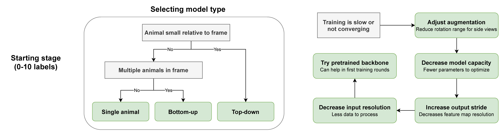
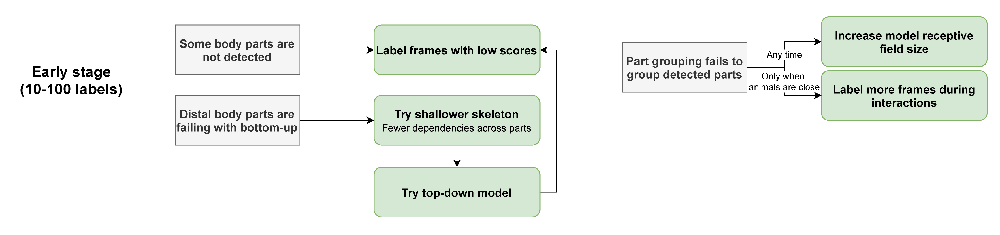

# Troubleshooting workflows

SLEAP can work with any type of data, but sometimes it may be helpful to tweak certain
configurations or try out different parameters to improve performance.

For the majority of cases, we recommend following these steps based on how far along you
are with your labeling.

When you are starting off, it may preferable to troubleshoot the model type and other
basic configurations if you can't get results at all after your initial training:

See  for more information on model types and how to configure them.

Once you have enough labeled frames and a working model, we suggest refining your models
by selecting frames to label that represent problem areas, such as when animals are
overlapping or adopting weird poses.

In the latter stages of labeling and training, you can squeeze out additional
performance by tuning hyperparameters that don't perform as well with little data:

If you still aren't getting good results, feel free to reach out by emailing us at
`talmo@salk.edu` or opening a [Github Issue](https://github.com/talmolab/sleap/issues) 
and tell us a bit about your data (preferably with sample screenshots/clips) and what
kinds of problems you're facing.
