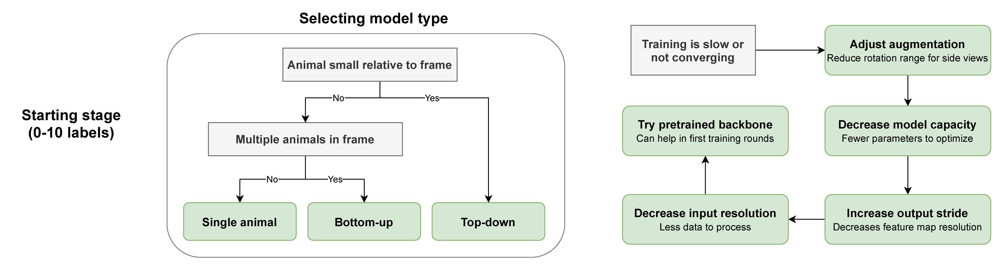
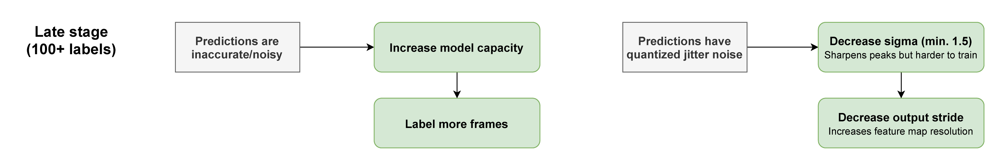

# Troubleshooting workflows

SLEAP can work with any type of data, but sometimes it may be helpful to tweak certain configurations or try out different parameters to improve performance.

!!! tip "Choose your stage"

    The troubleshooting steps depend on how far along you are with labeling:

    - **[Starting (0-10 labels)](#starting-stage-0-10-labels)**: Choose the right model type and fix basic training issues
    - **[Early (10-100 labels)](#early-stage-10-100-labels)**: Address missing detections and part grouping failures
    - **[Late (100+ labels)](#late-stage-100-labels)**: Fine-tune for accuracy and reduce prediction noise

---

## Starting stage (0-10 labels)

When you're starting off, focus on selecting the right model type and fixing basic training issues.

### Selecting model type

Choose your model type based on your data:

| Question | Answer | Model Type |
|----------|--------|------------|
| Is the animal small relative to the frame? | No | **Single animal** |
| Is the animal small relative to the frame? | Yes | Continue below... |
| Are there multiple animals in the frame? | No | **Bottom-up** |
| Are there multiple animals in the frame? | Yes | **Top-down** |

!!! info "Learn more"

    See [Configuring Models](configuring-models.md) for detailed information on model types and how to configure them.

### Training is slow or not converging

If your initial training is slow or fails to converge, try these fixes in order:

1. **Adjust augmentation**: Reduce the rotation range to ±90° instead of full 360° rotation. This is especially helpful when your animals have a consistent orientation.

2. **Try a pretrained backbone**: Using a pretrained backbone (like ResNet or EfficientNet) can help in the first training rounds by providing better initial feature representations.

3. **Decrease model capacity**: Reduce the number of filters or layers in your model. Fewer parameters means faster optimization with limited data.

4. **Decrease input resolution**: Lower the input image size to reduce the amount of data to process. This speeds up training at the cost of some spatial precision.

5. **Increase output stride**: A higher output stride decreases feature map resolution, reducing computation. Start with stride 4 or 8 if training is too slow.

---

## Early stage (10-100 labels)

Once you have enough labeled frames and a working model, focus on refining predictions by addressing specific failure modes.

### Some body parts are not detected

If certain body parts are consistently missing from predictions:

- **Label frames with low confidence scores**: Use the labeling suggestions panel with the "score" method to find frames where the model is uncertain. Adding labels for these frames helps the model learn difficult cases.

### Distal body parts fail with bottom-up models

If extremities (like tail tips, feet, or antennae) fail specifically with bottom-up models:

- **Try a shallower skeleton**: Reduce the number of connections between nodes. Fewer dependencies across parts can help when distal parts are hard to associate.

- **Try a top-down model**: Top-down models isolate each animal first, which can be more robust for complex skeletons with many nodes.

### Part grouping fails to connect detected parts

If the model detects individual body parts but fails to group them into complete animals:

| Are the animals occluded? | Solution |
|---------------------------|----------|
| **Yes** (overlapping) | Increase the model's **receptive field size** so it can see more context around each part |
| **No** (clearly visible) | Label more frames showing animals during **interactions** or close proximity |

---

## Late stage (100+ labels)

In the latter stages of labeling and training, you can squeeze out additional performance by tuning hyperparameters that require more data to work effectively.

### Predictions are inaccurate or noisy

If predictions are generally imprecise or jittery:

1. **Increase model capacity**: Add more filters or layers to give the model more representational power. With 100+ labels, larger models can learn more complex patterns without overfitting.

2. **Label more frames**: More training data almost always helps. Focus on frames where the current model struggles.

### Predictions have quantized jitter

If predictions snap to a grid or show discrete jumps between frames (quantization artifacts):

1. **Decrease sigma** (minimum: 1.5): A smaller sigma creates sharper confidence map peaks, allowing more precise subpixel localization. Don't go below 1.5 or the peaks become too narrow to optimize.

2. **Decrease output stride**: A lower output stride increases the feature map resolution, providing finer spatial granularity for predictions. This comes at the cost of more computation.

---

## Still having issues?

If you've tried these steps and still aren't getting good results, we're here to help:

- **Email**: [talmo@salk.edu](mailto:talmo@salk.edu)
- **GitHub Issues**: [github.com/talmolab/sleap/issues](https://github.com/talmolab/sleap/issues)

Please include:

- Sample screenshots or video clips showing the problem
- A description of what kinds of errors you're seeing
- What troubleshooting steps you've already tried
