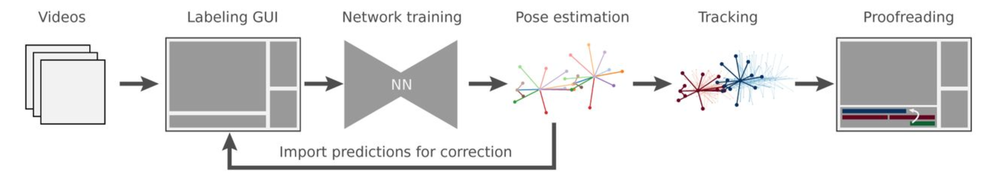

.. _`high-level overview`:

Overview
=========

In a nutshell, SLEAP allows you to train and use deep learning-based models that can automatically track the movements of any body parts of any number or type of animal from recorded videos. This enables precise and quantitative analysis of behavioral data.

Below is a high-level overview of a typical end-to-end workflow in SLEAP. You can also step through this workflow yourself in the :ref:`Tutorial` section.

1. Creating a new project and importing video file(s)
    You may import all or part of the video clips from your experiment footage. These video files will be used to build a ground-truth dataset and train the machine learning model that estimates animal pose.

    See :ref:`new-project`.

2. Defining animal skeleton(s)
    In this step you will define the animal skeleton by listing its body parts and their connections.

    See :ref:`new-skeleton`.

3. Selecting frames from imported video(s) for initial labeling
    Next you will select the initial set of frames for the labeling activity. SLEAP provides several options for selecting frames based on sampling or image features.

    See :ref:`selecting-frames`.

4. Manually labeling animal pose(s) in selected frames
    Labeling is the activity of mapping skeleton body parts to animal instances in the selected frames. This is the most laborious part, however SLEAP helps accelerate the process with a purpose-built user interface and iterative human-in-the-loop process that involves training machine learning models on partially labeled data and manually correcting its predictions.

    See :ref:`labeling-first-frame` and :ref:`labeling-more-frames`.

5. Training a machine learning model using the labeled frames
    After you labeled a few frames you can train a machine learning model. SLEAP supports several approaches for training, each with it's own set of parameters that can be configured.

    See :ref:`initial-training`.

6. Applying the trained model to predict animal poses in unlabeled frames (inference)
    Once the training is complete, the trained model is applied to all unlabeled frames to predict animal pose (this step is also called *inference*). The accuracy of these predictions depends on many parameters, among them the quality of the labeling work, amount of labeled frames, and the configuration of the training job.

    See :ref:`initial-inference`.

7. Refining the predicted labels manually, and repeating the training step until desired model accuracy is achieved
    In this step you can inspect the predictions and correct them - this is similar to the labeling step, but should be easier since the predictions place the skeletons approximately right.

    See :ref:`assisted-labeling`.

8. [Optional] Importing additional videos from your experiment, and applying the trained model to predict animal poses
    Once the machine learning model performance is satisfactory (w.r.t. pose estimation quality), the next step is to predict the animal poses across all video frames from your experiment. This step is only needed if not all video(s) were imported in the first step.

    See :ref:`merging`.

9. Applying the tracking algorithm to track animal instances across frames
    Tracking associates animal instances in consequent frames. Here too SLEAP provides several algorithms for tracking with their own configuration parameters.

    See: :ref:`proofreading-tutorial`

10. Proofreading and potentially correcting instance tracks
     This is a manual step where you can use SLEAP GUI to verify that the tracking is accurate, and make corrections as needed.

     See :ref:`track_proofreading` for types of errors that may occur and how to correct them.

11. Exporting data for analysis
     Finally you can export the generated data (including animal instance occupancy matrices and tracks) for further analysis (e.g. in Matlab or Python).

     See :ref:`export-analysis` and example :ref:`Notebooks` for details.
