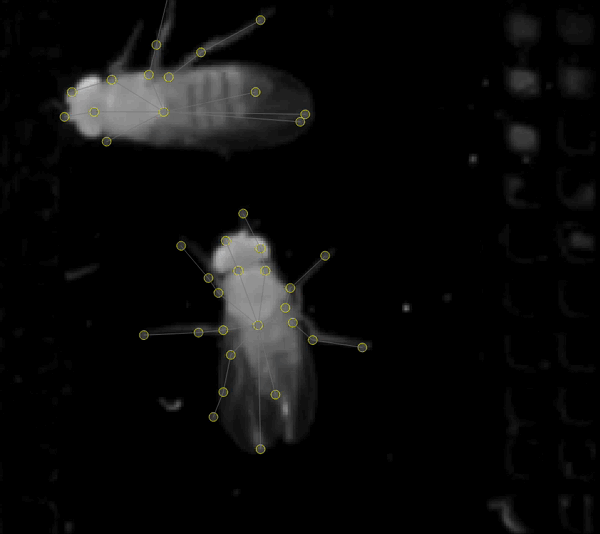

.. _assisted-labeling:

Prediction-assisted labeling
~~~~~~~~~~~~~~~~~~~~~~~~~~~~

*Prediction-assisted labeling* has two main goals. First, it speeds up the labeling
process as it is faster to correct a predicted instance which is mostly
correct than it is to add a new instance from scratch. Second, it
provides feedback about where your model does well and where it does
poorly, and this should give you a better idea of which frames will be
most useful to label.

The GUI doesn’t yet give you a way to monitor the progress during inference,
although it will alert you if an error occurs during inference.

When inference finishes, you’ll be told how many instances were
predicted. Suggested frames with predicted instances will be marked in
red on the seekbar.

Reviewing and fixing predictions
~~~~~~~~~~~~~~~~~~~~~~~~~~~~~~~~

After you’ve successfully trained models and predicted some instances,
you’ll get a message that inference has finished.
Predictions will be marked with a thin black line on the seekbar, while frames
that you manually labeled will be marked with a thicker black line. (For
"suggested" frames, manually labeled frames will have a dark blue line and
predicted frames will have a lighter blue.)

Predicted instances will *not* be used for future model training unless you
correct the predictions in the GUI.

|imagefix|

Predicted instances in the frame are displayed in grey with yellow
nodes. To edit a prediction, you’ll need to replace it with an editable
instance. **Double-click** the predicted instance and it will be converted into a regular instance.

You can now edit the instance as before. Once you’ve added and/or
corrected more instances, you can repeat the process:
train a new model, predict on more frames, correct those predictions,
and so on. You’ll want to regularly generate new frame suggestions,
since active learning will return predictions for just these frames.

After you have accurate frame-by-frame prediction, you’re ready to predict for entire video clips and to track animal identities. We use a variety of heuristic algorithms for tracking identities across time (see :ref:`tracking-method-details` for more details). SLEAP also includes a graphical proof-reading tool for quickly assessing the accuracy of tracking and correcting problems.

Continue to :ref:`proofreading-tutorial`.

