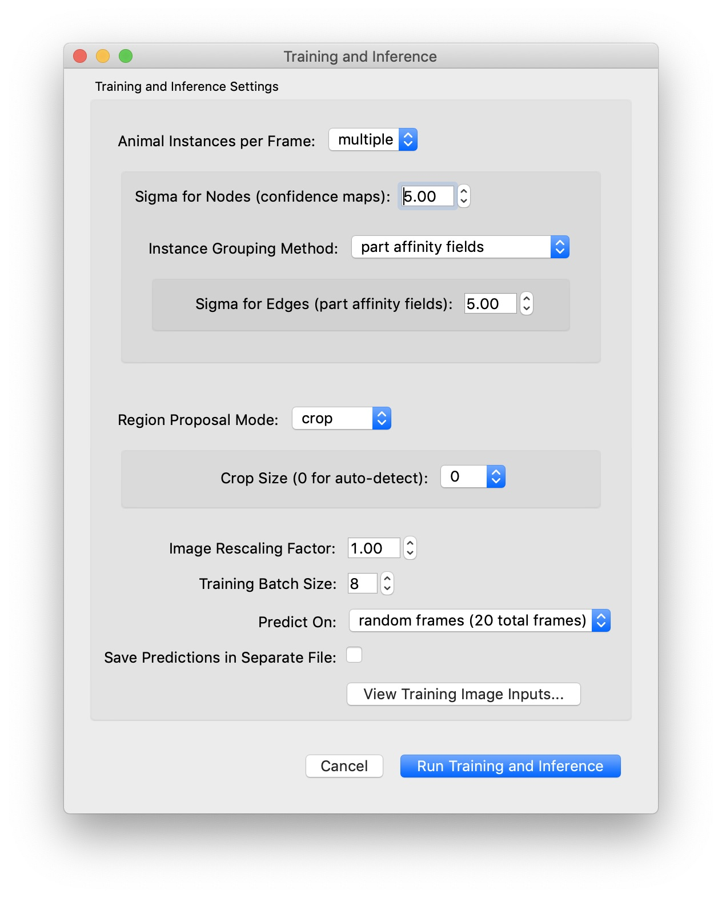

.. _initial-training:

Training and Inference
----------------------------
After labeling about 10 frames and saving the project you can train your first model and start getting initial predictions.

.. note::

    This tutorial assumes you have a GPU in your local machine and that TensorFlow is able to use your GPU. If you don't have a GPU or you're having trouble getting it to work, you can run training and inference in the cloud. See our :ref:`colab` guide! Or take a look at our other :ref:`guides` about running SLEAP on remote machines.

.. _training-options:

Training Options
~~~~~~~~~~~~~~~~~~~

When you're ready to train you will have three choices for models: *single animal*, multi-animal **top-down**, or multi-animal **bottom-up**.

In **top-down** mode for multiple animals, a network first finds each animal and then a separate network estimates the pose of each found animal:

.. image:: ../_static/topdown_approach.jpg

In **bottom-up** mode, a network first finds all of the body parts in an image, and then another network groups them into animal instances using part affinity fields (`Cao et al., 2017 <https://arxiv.org/abs/1611.08050>`_):

.. image:: ../_static/bottomup_approach.jpg

We find that top-down mode works better for some multi-animal datasets while bottom-up works better for others - to maximize the accuracy of predictions we recommend you to try both and see which one works best for your dataset.

In addition, SLEAP uses UNET as its default backbone, but you can choose other backbones (LEAP, resnet, etc.) from a drop down menu.

For more information about the types of models you can train, see :ref:`choosing_models`.

Start Training
~~~~~~~~~~~~~~~~

To run training on your local machine, select “**Run Training…**” from the “Predict”
menu. For this tutorial, let's use the default settings for training with the "top-down" pipeline and predict on 20 random frames.

|image6|

Recall that the "topdown" approach will train two models: one for locating each instance in the frame, and one for locating the parts for each of those instances. The models will be trained in that order.

When using the topdown approach, it's a good idea to choose an **anchor** part which has a relatively stable position near the center of your animal. You may also want to turn on the option to "**Visualize Predictions During Training**" (although this will make training run a bit more slowly).

Once you hit the **Run** button, you should see a window which shows you a graph of training and validation loss for each model as it trains. Since the topdown approach trains two models, once you're done training the centroid model the graph will reset to show you loss while training the centered instance model.

Just for this tutorial, let's stop each training session after about 10 epochs. This should take a minute or two for each model (assuming you have a usable GPU!), and should be good enough to get some initial predictions.

.. _initial-inference:

Inference
~~~~~~~~~~~~
After each model is trained, inference will run and if everything is successful, you should get a dialog telling you how many frames got predictions. Frames with labels will be marked in the seekbar, so try clicking on the newly marked frames or use the "**Next Labeled Frame**" command in the "Go" menu to step through frames with labels.

Once you got the initial predictions from the trained models you enter into a human-in-the-loop training cycle, in which you receive predictions and use them to continue to label more examples. You will continue to iterate this process until you have achieved the desired pose labeling accuracy for your dataset. The goal at this stage is to get accurate pose predictions on individual frames. This means that the points for each body part are predicted in the correct locations and that the points are correctly grouped into distinct animal instances.

Continue to :ref:`assisted-labeling`.

