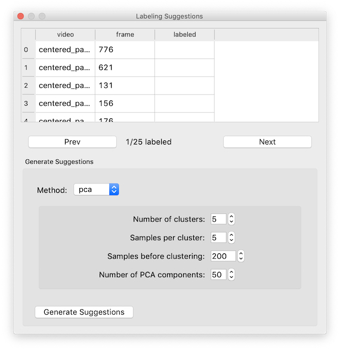
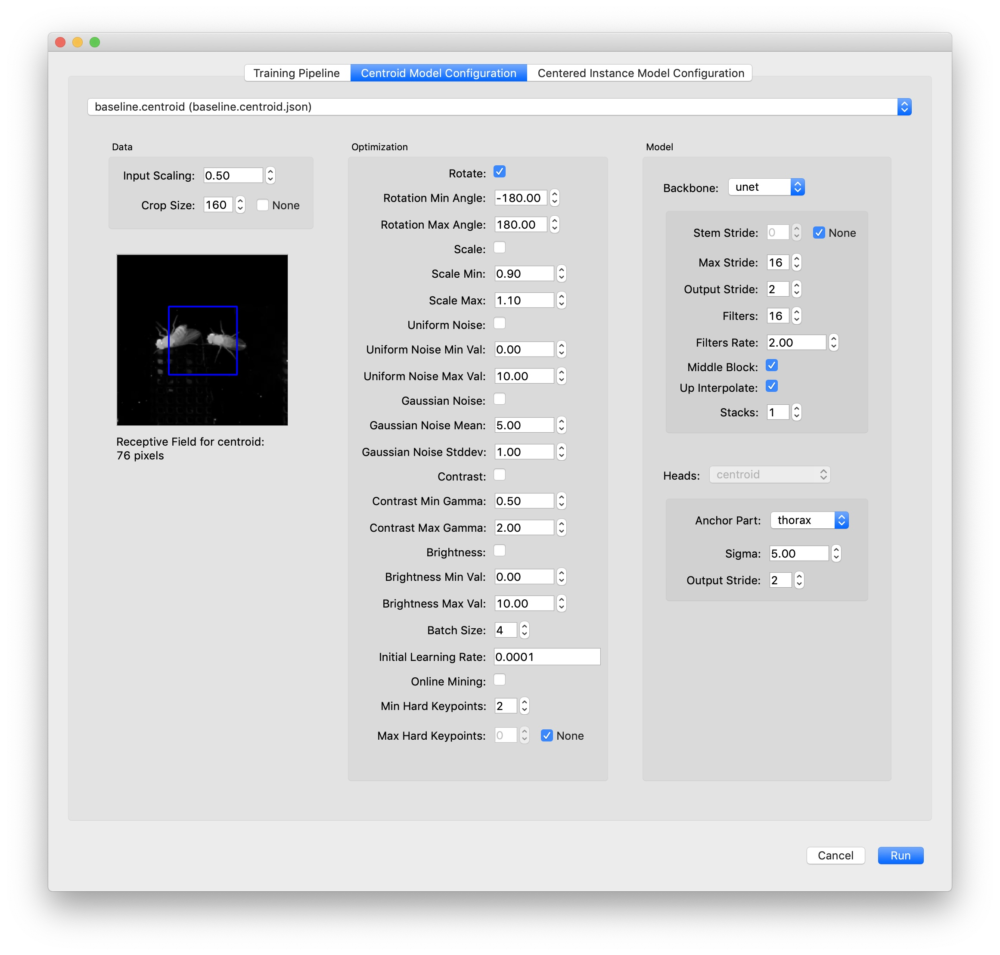
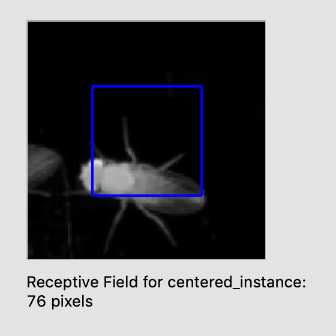
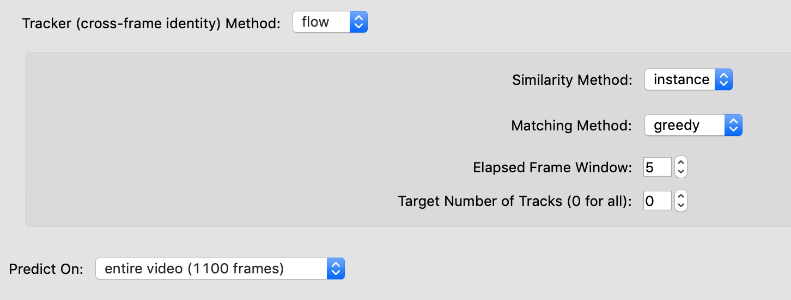
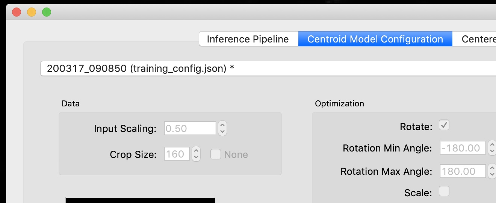
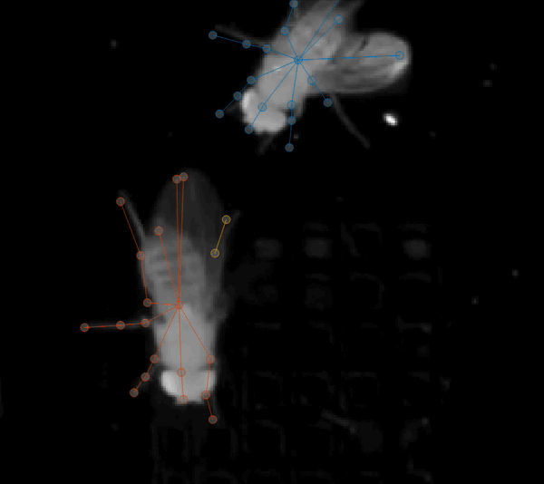

.. _proofreading-tutorial:

Tracking instances across frames
-----------------------------------------

When you’re satisfied with the predictions you’re getting, you can use your models to predict on more frames by selecting
“**Run Inference…**” from the “Predict” menu. This will use the most
recently trained set of models.

The inference dialog is almost identical to the training dialog with a few key differences.

The inference dialog allows you to choose a method to use for tracking
instance identities but also has a place to select the **tracker**.

|tracker|

See :ref:`tracking-method-details` for more information about the tracker methods and options.

By default the inference dialog will use the most recently train model (or set
of models), but if you want to choose another trained model, you can do this
by using the dropdown menu on the tab for the relevant model type.

|model-selection|

.. _track_proofreading:

Track proofreading
~~~~~~~~~~~~~~~~~~

Once you have predicted tracks, you’ll need to proofread these to ensure
that the identities of instances across frames are correct. By default,
predicted instances all appear in grey and yellow. Select “Color
Predicted Instances” to show the tracks in color. (Note that colors in
the frame match colors in the seekbar and colors in the “Instances”
panel.) Click an instance to see it’s track name. Double-click the track
name in the “Instances” panel to change the name.

There are two main types of mistakes made by the tracking code: mistaken
identities and lost identities.

**Mistaken Identities:** The code may misidentify which instance goes in
which track, in which case you’ll want to “swap” the identities.

You can swap the identities assigned to a pair of instances by selecting
“Transpose Instance Tracks” in the “Labels” menu. If there are just two
instances in the frame, it already knows what it do. If there are more,
you’ll have to click the two instances you want to swap.

|image9|

You can assign an instance to a different (or new) track from the “Set
Instance Track” submenu in the “Labels” menu.

You can select instances by typing a number between 1 and 9, by clicking
the instance in the frame, or by clicking the instance in the
“Instances” panel (on the right side of your main window). When an
instance is selected, you’ll see its track name. These track names can
be edited by double-clicking the track name in the “Instances” panel.

When you assign an instance to a track, this change will also be applied
to all *subsequent* frames. For instance, if you move an instance from
track 3 to track 2, then any instance in track 3 in subsequent frames
will also be moved to track 2. This lets you effectively “merge” tracks.

**Lost Identities:** The code may fail to identity an instance in one
frame with any instances from previous frames. In this case, you’ll want
to find the first frame in which the new track occurs and change the
instance track to the track from previous frames. The “Next Track Spawn
Frame” command in the “Labels” menu will take you to the next frame in
which a new track is spawned.

For more tools and tips, see the :ref:`proofreading` guide.

Once you're done proofreading, you'll want to :ref:`export-analysis`.

.. |image0| image:: ../_static/add-video.gif
.. |image1| image:: ../_static/video-options.gif
.. |image2| image:: ../_static/add-skeleton.gif

.. |image4| image:: ../_static/labeling.gif
.. |image5| image:: ../_static/toggle-visibility.gif
.. |image6| image:: ../_static/training-dialog.jpg

.. |imagefix| image:: ../_static/fixing-predictions.gif

